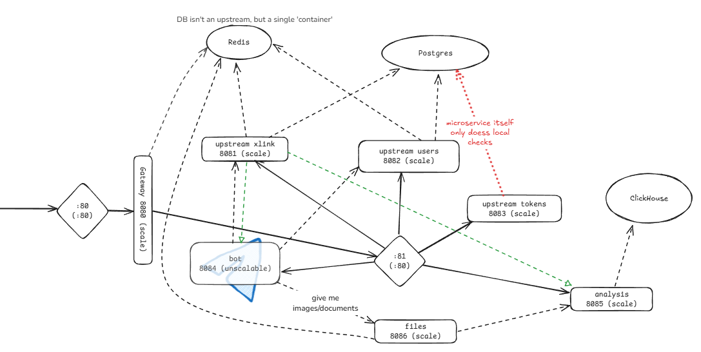
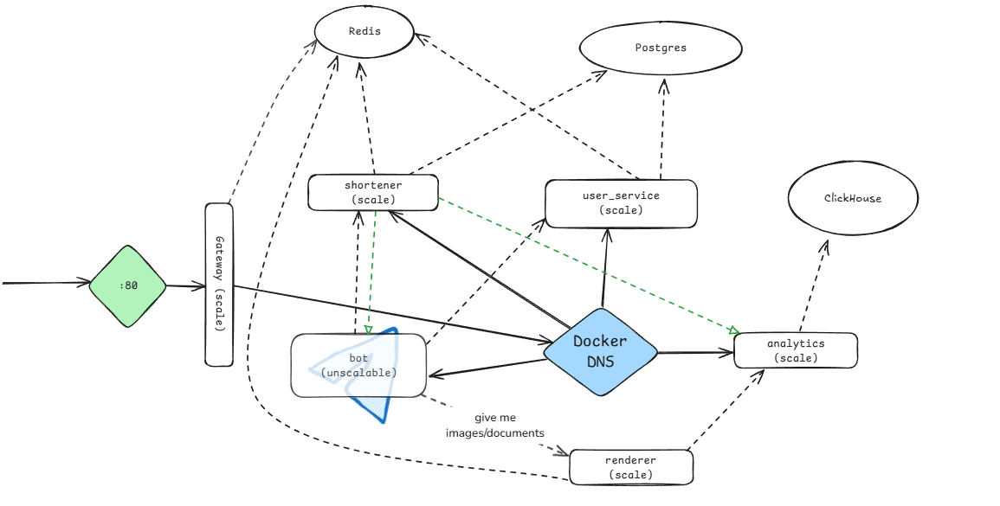
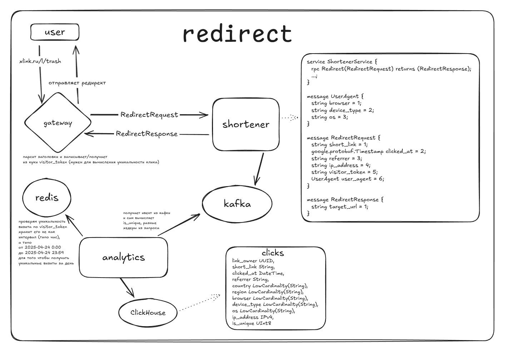

# Архитектура проекта

## 1. Состав распределённой системы

### Схема

Вот так планировали:

Вот к такой пришли:

### Список микросервисов:

1. **gateway** - API Composer с проверкой доступа и примитивной аггрегацией данных
2. **user_service** - CRUD пользователей, хранение токенов
3. **shortener** - CRUD ссылок, сокращатель и kafka producer для **analytics**
(отправляет статистику переходов)
4. **analytics** - kafka consumer, собирающий данные из сообщений в Clickhouse и
аггрегирующий их по разным полям (на выбор)
5. **tg_bot** - телеграм-клиент для сервиса, для запросов к сервисам использует **gateway**.
Развёрнут локально, но даже так на запросы отвечает

### Состав docker-compose:

1. **entry_nginx** - отправляет запросы в gateway, позволит нам включить SSL
2. _микросервисы_ - хранятся в разных контейнерах
3. **postgres** - общая БД
4. **redis** - общий кэш
5. **zookeeper** - нужен для кафки
6. **kafka** - брокер сообщений (логично)
7. **clickhouse** - БД для хранения анализируемых данных

## 2. Архитектурные решения

### Выбор технологий
* **Go** - язык, на котором написаны все микросервисы
* **gRPC** - протокол, по которому общаются микросервисы
* **PostgreSQL** - реляционная БД, в которой хранятся пользователи и ссылки
* **Redis** - кэш, в котором хранятся различные токены и ссылки
* **Kafka** - брокер сообщений, в который отправляются события переходов по ссылкам
* **Сlickhouse** - аналитическая БД, в которой хранятся события переходов по ссылкам
* **Nginx** - веб-сервер, который принимает запросы от пользователей и отправляет их в gateway
* **Docker** - контейнеризация всех микросервисов и зависимостей
* **Docker Compose** - управление контейнерами и их зависимостями

### Душа и сердце проекта

### Маршрутизация

В проекте есть **docker-compose**, создающий **2 докер-сети**: с доступом из внешнего мира (для nginx) и
без него. **Nginx** перебрасывает запросы в **gateway**, остальное за нас делает **Docker.**

### Масштабирование

Всё, что **масштабируется**, масштабируется через **docker**. Причём **маршрутизацией** в группе 
контейнеров занимается он же, потому что нам не нужна гибкость: нам нужна группа контейнеров,
доступная по 1 порту, и запускающаяся из 1 описания сервиса в _docker-compose.yaml_.

### Паттерны отказоустойчивости

Для одиночных вызовов где-то между микросервисами используется лёгкий **Timeout**, gateway же использует
**Retry**. Если для получения результата надо сделать **несколько запросов подряд**, после первой ошибки
происходит выход из функции (это относится к gateway).

Другие паттерны отказоустойчивости не применяются (посчитали ненужным).

Настройки для вызовов есть и находятся в конфигах.

### Кэширование

Кэширование происходит в Redis, в одном общем контейнере. Сервисы используют разные БД внутри него.

Кэшируются далеко не все данные (нехватка времени), некоторые надолго, некоторые - на короткий срок, так как могут
быстро поменяться.

### Соединения и общение между микросервисами

#### Запрос-ответ

Все микросервисы, кроме **gateway** и **бота**, являются gRPC-сервисами. **Gateway** - HTTP-сервис на fiber
(из 2 вариантов: _Echo_ и _Fiber_ - выбрали более знакомый фреймворк).

Запросы между микросервисами используют либо самописный **gRPC Pool** (Gateway), либо одиночные соединения,
которые генерируются каждый раз заново.
* Gateway держит **целый пул**, потому что создание соединений отнимает
время.
* Остальные сидят на **одиночных grpcConn**, потому что нечасто вызываются.

#### Сообщения

Также в проекте используется передача сообщений (изначально планировалось использовать
**RabbitMQ** как более простой вариант, однако в задании требуется **kafka**).

Сообщения передаются в топике _"redirect-events"_, количество реплик и партиций задано как _1_.

## 3. Структура проекта

1. **папки с названиями микросервисов** - модули соответствующих микросервисов
2. **./build**
   1. докер-файлы на все сервисы
   2. docker-compose.yml
   3. конфиг nginx
3. **./common** - модуль, в котором хранятся
   1. клиенты для БД, kafka
   2. логгер
   3. функции Retry/Timeout
   4. результаты генерации из proto-файлов
4. **./configs** - текстовые файлы конфигов
   1. config.yaml (и сгенеренный из него .env)
   2. .env.example и tg_bot.env.example
5. **./docs** - документация в Markdown по эндпоинтам Gateway,
конфигам и архитектуре. Разбита по файлам
